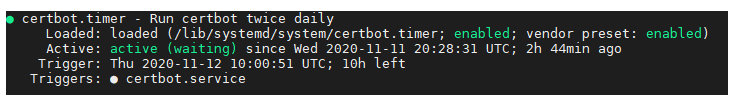

# HTTPS

## Install certbot

HTTPS is a little more difficult to set up when using Django Channels. Nginx and Daphne require some extra configuring.

```bash
sudo apt install certbot python3-certbot-nginx
```

```bash
sudo systemctl reload nginx
```

Make sure nginx configuration is still good.

```bash
sudo nginx -t
```

## Allow HTTPS through firewall

```bash
sudo ufw allow 'Nginx Full'
```

## Obtain SSL certificate

```bash
sudo certbot --nginx -d <your-domain.whatever> -d www.<your-domain.whatever>
```

## Verifying Certbot Auto-Renewal

```bash
sudo systemctl status certbot.timer
```

Test renewal process

```bash
sudo certbot renew --dry-run
```

You should see this

