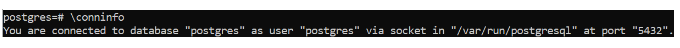

# PostgreSQL

## Check PostgreSQL status

After the installation you may double-check that postgresql daemon is active.

```bash
service postgresql status
```

The output should look like this:


## Start Using PostgreSQL Command Line Tool
When you install PostgreSQL a default admin user “postgres” is created by the default. You must use it to log-in to your PostgreSQL database for the first time.

A “psql” command-line client tool is used to interact with the database engine. You should invoke it as a “postgres” user to start an interactive session with your local database.

```bash
sudo -u postgres psql
```


In addition to creating a postgres admin user for you, PostgreSQL installation also creates a default database named “postgres” and connects you to it automatically when you first launch psql.

After first launching psql, you may check the details of your connection by typing \conninfo into the interpreter.




You are now connected to database “postgres” as user “postgres”.

If you want to see a list of all the databases that are available on a server, use \l command.


And to see a list of all the users with their privileges use \du command.


Since the default “postgres” user does not have a password, you should set it yourself.

\password postgres

## Setup PostgreSQL server

It’s fun to play with the database locally, but eventually you will need to connect to it through a remote server.

When you install a PostgreSQL server, it is only accessible locally through the loopback IP address of your machine. However, you may change this setting in the PostgreSQL configuration file to allow remote access.

Let’s now exit the interactive psql session by typing exit, and access postgresql.conf configuration file of PostgreSQL version 14 by using vim text editor.

```bash
vim /etc/postgresql/14/main/postgresql.conf
```

Uncomment and edit the listen_addresses attribute to start listening to start listening to all available IP addresses.

```bash
listen_addresses = '*'
```

Now edit the PostgreSQL access policy configuration file.

```bash
vim /etc/postgresql/14/main/pg_hba.conf
```

Append a new connection policy (a pattern stands for [CONNECTION_TYPE][DATABASE][USER] [ADDRESS][METHOD]) in the bottom of the file.


host all all 0.0.0.0/0 md5


We are allowing TCP/IP connections (host) to all databases (all) for all users (all) with any IPv4 address (0.0.0.0/0) using an MD5 encrypted password for authentication (md5).


It is now time to restart your PostgreSQL service to load your configuration changes.

```bash
systemctl restart postgresql
```

And make sure your system is listening to the 5432 port that is reserved for PostgreSQL.

ss -nlt | grep 5432


If everything is OK, you should see this output.
